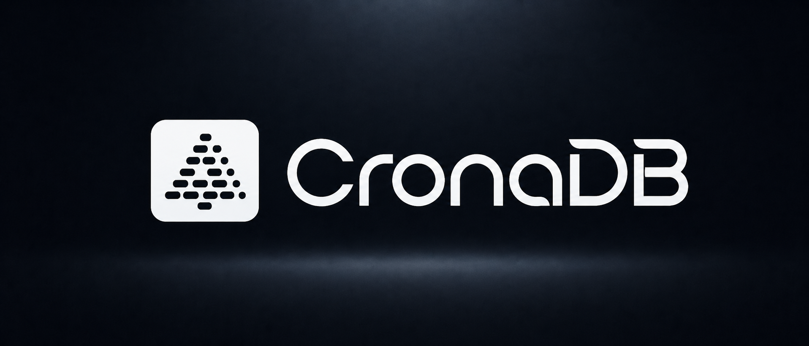

<p align="center">
  
</p>

<p align="center"><b>SQLite for graphs that change over time.</b></p>

<p align="center">
  An embedded temporal graph database. One file. No server. Time-travel built in.
</p>

<p align="center">
  <a href="https://github.com/thetejasagrawal/CronaDB/actions/workflows/ci.yml"></a>
  <a href="https://crates.io/crates/chrona-core"></a>
  <a href="https://pypi.org/project/chrona/"></a>
  <a href="LICENSE-MIT"></a>
  <a href="https://www.rust-lang.org"></a>
  <a href="https://github.com/thetejasagrawal/CronaDB/stargazers"></a>
</p>

<p align="center">
  <a href="#install">Install</a> ·
  <a href="#60-second-tour">60-second tour</a> ·
  <a href="#why-cronadb">Why</a> ·
  <a href="#how-it-compares">Compare</a> ·
  <a href="./ARCHITECTURE.md">Architecture</a> ·
  <a href="https://github.com/thetejasagrawal/CronaDB/discussions">Discuss</a>
</p>

---

## What is it

CronaDB stores changing relationships as a graph, but every edge carries when
it became true, when it stopped being true, where you learned about it from,
and how confident you are in it. Then you query the graph not just as it is
now, but **as it was at any moment in the past**.

```
$ chrona query memory.chrona 'WHO WAS CONNECTED TO "alice" ON "2026-01-20"'
bob        WORKS_WITH  valid=[2026-01-15..)  src=slack  conf=0.90

$ chrona query memory.chrona 'WHAT CHANGED BETWEEN "2026-02-01" AND "2026-04-01"'
+ carol -[REPORTS_TO]-> alice   (2026-02-01)
- dan   -[ADVISES]->    alice   (invalidated 2026-03-15)
```

One file on disk. Embedded in your process — no server, no network. Reads in
microseconds, writes are durable on commit.

## Why CronaDB

Most graph databases either need a cluster to run (Neo4j, TigerGraph,
Memgraph) or treat time as an afterthought you bolt on with timestamp columns.

CronaDB makes time first-class. Every edge has:

| Field | Meaning |
|---|---|
| `valid_from` / `valid_to` | The window the relationship is true in the world |
| `observed_at` | When you (the system) learned about it |
| `source` | Where it came from |
| `confidence` | How much you trust it |
| `supersedes` | Pointer to the previous revision |

That single move — making the temporal envelope part of the data model
instead of an extra table — turns the graph into a system you can rewind,
audit, and explain.

## Use it for

- **Agent / LLM memory.** An agent's beliefs change over time. CronaDB
  natively stores "I thought X at time T1, then I learned Y at time T2" with
  a revision chain you can walk for explainability.
- **Knowledge graphs from messy sources.** Slack scrapes, email parsers, and
  CRM exports disagree. Track who said what, when, with what confidence —
  reconcile later instead of upfront.
- **Audit and compliance.** Anything where "who reported to whom on date D"
  needs to be answerable months later, exactly.
- **Dependency / provenance tracking.** Service ownership, infra topology,
  data lineage — graphs whose edges actually do change, but whose history
  matters.
- **Temporal feature stores.** Joins like "what was the user's friend graph
  at the moment of this prediction" without a Lambda-architecture rebuild.

## Install

```bash
git clone https://github.com/thetejasagrawal/CronaDB
cd CronaDB
cargo install --path crates/chrona-cli
```

That gives you the `chrona` CLI. The Rust library and Python package are
documented below.

> **Note:** crates.io and PyPI publication is in flight. Until then, install
> from this repo (Rust) or `maturin develop` from `crates/chrona-py/` (Python).

## 60-second tour

```bash
chrona init demo.chrona
chrona import demo.chrona --file people.csv --format csv

# What's true right now
chrona query demo.chrona 'FIND NEIGHBORS OF "alice"'

# What was true on a specific day
chrona query demo.chrona 'WHO WAS CONNECTED TO "alice" ON "2026-01-20"'

# How a 2-hop neighborhood looked at a past time
chrona query demo.chrona 'FIND 2 HOPS FROM "alice" AT "2026-03-01"'

# What changed across a window
chrona query demo.chrona 'WHAT CHANGED BETWEEN "2026-03-01" AND "2026-04-01"'

# Filter and limit
chrona query demo.chrona \
  'FIND NEIGHBORS OF "alice" WHERE source = "slack" AND confidence >= 0.8 LIMIT 20'

# JSON output for pipelines
chrona query demo.chrona --json 'WHAT CHANGED BETWEEN "2026-01-01" AND "2026-04-01"'

# Open a REPL
chrona repl demo.chrona
```

Full CLI reference: `chrona --help`. Full grammar:
[docs/query-language.md](./docs/query-language.md).

## Library usage

### Rust

```rust
use chrona_core::{Db, EdgeInput, Ts};

let db = Db::open("demo.chrona")?;

db.write(|w| {
    w.upsert_node("alice", Some("person"))?;
    w.add_edge(EdgeInput {
        from: "alice".into(),
        to: "bob".into(),
        edge_type: "WORKS_WITH".into(),
        valid_from: Ts::parse("2026-01-15")?,
        valid_to: None,
        observed_at: Ts::now(),
        source: "slack".into(),
        confidence: 0.9,
        properties: Default::default(),
    })?;
    Ok(())
})?;

let snap = db.begin_read()?;
let alice = snap.get_node_id("alice")?.unwrap();
for edge in snap.neighbors_as_of(alice, Ts::parse("2026-02-01")?)? {
    println!("{:?}", edge);
}
```

### Python

```python
import chrona

db = chrona.Db("demo.chrona")

with db.write() as w:
    w.upsert_node("alice", node_type="person")
    w.add_edge(
        from_="alice", to="bob", edge_type="WORKS_WITH",
        valid_from="2026-01-15", source="slack", confidence=0.9,
    )

# DSL query
for edge in db.query('FIND NEIGHBORS OF "alice" WHERE confidence >= 0.8'):
    print(edge)

# Time-travel through the read API
with db.read() as snap:
    alice = snap.node_id("alice")
    for edge in snap.neighbors_as_of(alice, "2026-02-01"):
        print(edge.to_ext_id, edge.edge_type)
```

Python wheels are `abi3-py37` — one wheel works on Python 3.7+.

## How it compares

| | CronaDB | Neo4j / Memgraph | SQLite | DuckDB | Datomic |
|---|---|---|---|---|---|
| Embedded, no server | ✅ | ❌ | ✅ | ✅ | ❌ (peer) |
| First-class graph model | ✅ | ✅ | ❌ | ❌ | ✅ |
| First-class temporal model | ✅ | bolt-on | bolt-on | bolt-on | ✅ |
| Single file on disk | ✅ | ❌ | ✅ | ✅ | ❌ |
| Open source | ✅ MIT/Apache | ✅ GPL/comm. | ✅ PD | ✅ MIT | ❌ |
| Written in | Rust | Java/C++ | C | C++ | Clojure/JVM |

The shortest pitch: **if SQLite and Datomic had a baby that ran in your
process and remembered everything, you'd get CronaDB.**

## Performance

Measured on an Apple M-series MacBook (release build, criterion v0.5):

| Operation | P50 | Notes |
|---|---|---|
| Cold open (1 k edges) | **~14.6 ms** | open → ready for reads |
| 1-hop traversal | **~2.3 µs** | `neighbors_as_of` on a hot path |
| 2-hop BFS | **~16.4 µs** | deduped BFS with temporal filter |
| Temporal `as_of` | **~2.5 µs** | mid-window `T` on 5 000 versioned edges |
| Diff scan (5 k events) | **~386 µs** | ≈ 77 ms projected for 1 M events |
| Ingest (single txn) | **~37 k edges/s** | durable writes, fsync per commit |

Benchmarks live in `crates/chrona-core/benches/` — run them yourself with
`cargo bench`. Methodology: [docs/benchmarks.md](./docs/benchmarks.md).

## Architecture

```
┌──────────────────────────────────────────────────┐
│  chrona CLI   │   chrona-py (PyO3)  │  (napi)   │
├──────────────────────────────────────────────────┤
│  chrona-query  — DSL: lex → parse → plan → exec  │
├──────────────────────────────────────────────────┤
│  chrona-core   — graph · temporal · provenance   │
│                  event log · snapshot · tables   │
├──────────────────────────────────────────────────┤
│  redb          — single-file MVCC B-tree         │
├──────────────────────────────────────────────────┤
│  database.chrona                                 │
└──────────────────────────────────────────────────┘
```

Core ideas: an append-only event log is the source of truth; the live state
graph and temporal indexes are derivable projections; readers and the writer
never block each other (snapshot isolation via redb's MVCC).

Deep dive: [ARCHITECTURE.md](./ARCHITECTURE.md). On-disk byte format:
[FORMAT.md](./FORMAT.md).

## FAQ

**Is the file format stable?** Yes — version 1, locked at 1.0. Files written
by any 1.x release will be readable by every 1.x release. See the stability
contract in [CHANGELOG.md](./CHANGELOG.md).

**Can multiple processes write to the same file?** No — single-writer
semantics, just like SQLite without WAL mode. Concurrent readers are fine
and cheap (snapshot isolation).

**Why redb under the hood?** Because the goal is "SQLite reliability for
graphs," and redb gives us a battle-tested single-file MVCC B-tree without
unsafe code. The plan is to keep the storage layer pluggable in case that
calculus changes.

**How does this differ from a Neo4j with timestamp properties?** Neo4j (or
any graph DB without native temporal) makes you reinvent every query: you
filter by timestamp, you reason about overlapping intervals, you build your
own bitemporal layer. CronaDB does that work in the engine — `AT "t"`,
`BEFORE "t"`, `WHO WAS CONNECTED ... ON "t"` are first-class operators with
indexes built for them.

**Is there a query language other than the DSL?** Today, no — only the DSL
and the typed Rust/Python APIs. The DSL is intentionally tiny (six query
shapes) because it's easier to ship a small, complete language than a big,
ambiguous one. Future versions will grow it under the same SemVer contract.

**Can I use it from JavaScript / Go / Java?** Not yet directly. Anything
with FFI can call `chrona-core` via the C ABI (`extern "C"`); native
bindings for JS (napi-rs) are the next planned binding.

**License?** Dual MIT / Apache-2.0. Use it commercially, vendor it, fork it.

## Examples

Runnable end-to-end demos under `examples/`:

- [`examples/agent_memory`](./examples/agent_memory) — an LLM agent revising
  beliefs about the world and querying them at different points in time.
- [`examples/dependency_tracking`](./examples/dependency_tracking) —
  service-dependency topology that evolves; query "who depended on the
  payments service before the incident."

Run either with `cargo run --example <name> -p chrona-core`.

## Contributing

Issues and PRs welcome. Read [CONTRIBUTING.md](./CONTRIBUTING.md) before
opening a feature PR — CronaDB holds scope intentionally.

Areas where help is especially valued:

- Benchmark datasets and adversarial workloads
- Docs and tutorials
- Language bindings (JavaScript via napi-rs, Go, Java)
- Connectors (Parquet, GraphML, OpenLineage)

## Get involved

- ⭐  **[Star the repo](https://github.com/thetejasagrawal/CronaDB)** — it's
  the cheapest signal that this is worth pushing forward.
- 💬  **[Discussions](https://github.com/thetejasagrawal/CronaDB/discussions)**
  for ideas, use cases, and questions.
- 🐛  **[Issues](https://github.com/thetejasagrawal/CronaDB/issues/new/choose)**
  for bugs and feature requests.
- 🔒  **[Security advisories](https://github.com/thetejasagrawal/CronaDB/security/advisories/new)**
  for anything that shouldn't be public.

## License

Dual-licensed under either:

- Apache License, Version 2.0 ([LICENSE-APACHE](./LICENSE-APACHE))
- MIT license ([LICENSE-MIT](./LICENSE-MIT))

at your option. Contributions are licensed under the same terms unless
explicitly stated otherwise.

## Design principles

CronaDB is built around a small set of beliefs documented in
[ARCHITECTURE.md](./ARCHITECTURE.md):

- **Time is first-class.** Every relationship carries validity.
- **The event log is the source of truth.** The state graph is derivable.
- **Edges are immutable.** Revisions append, never overwrite.
- **Do one thing well.** Embedded, single-file, single-writer. No
  distributed story in 1.x.

If those resonate, you'll probably like working on this.
